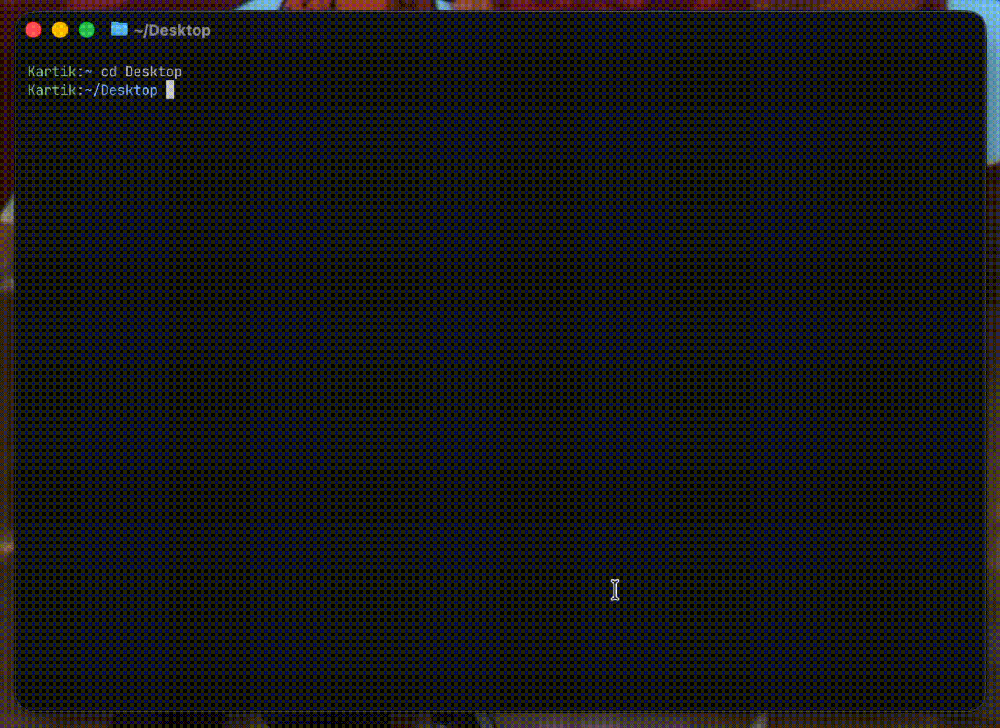

# Pokedex CLI

A simple CLI tool for printing ASCII art of any Pokemon directly in your terminal.



## Features

- Display any Pokemon as colored ASCII art
- Support for all 1025+ Pokemon
- Shiny variant support
- Random Pokemon selection
- Caching for fast subsequent lookups
- Verbose mode for timing information

## Installation

```bash
uv tool install -e .
```

## Usage

### Look up a Pokemon by name

```bash
pokedex pikachu
pokedex charizard
pokedex mewtwo
```

### Look up by Pokedex number

```bash
pokedex --number 25
pokedex --number 150
```

### Get a random Pokemon

```bash
pokedex --random
```

### Get a random Pokemon from cache

```bash
pokedex --random-cached
```

### Shiny variants

Add the `--shiny` flag to any command:

```bash
pokedex pikachu --shiny
pokedex --random --shiny
pokedex --number 150 --shiny
```

### Verbose mode

Show timing information with `-v` or `--verbose`:

```bash
pokedex pikachu --verbose
```

Output:
```
Pikachu (#25)
From saved list (resolved in 1.39ms)
```

Or for fresh fetches:
```
Pikachu (#25)
Fetched from API (took 523.41ms, total 528.12ms)
```

## Options

| Option | Description |
|--------|-------------|
| `<pokemon_name>` | Name of the Pokemon to display |
| `--number <n>` | Look up Pokemon by Pokedex number (1-1025) |
| `--random` | Display a random Pokemon |
| `--random-cached` | Display a random Pokemon from cache |
| `--shiny` | Display the shiny variant |
| `-v, --verbose` | Show timing information |

## Caching

ASCII art is cached locally in `~/.pokedex/cache/` for faster subsequent lookups. The first time you look up a Pokemon, it will fetch from the PokeAPI. Subsequent lookups will be instant.

## Requirements

- Python 3.12+
- Pillow

## License

MIT
